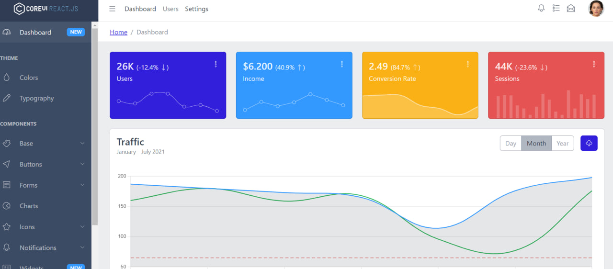

# adminPanelCoreUI
<h1>adminPanelCoreUI ReactJs - JS</h1>

<h3>Использованные техналоги</h3>
<ul>
    <li>react js</li>
    <li>sass</li>
</ul>

## Устанавливаем зависимости
npm install && yarn install

## Завпускаем в dev режим 
npm start && yarn start 
